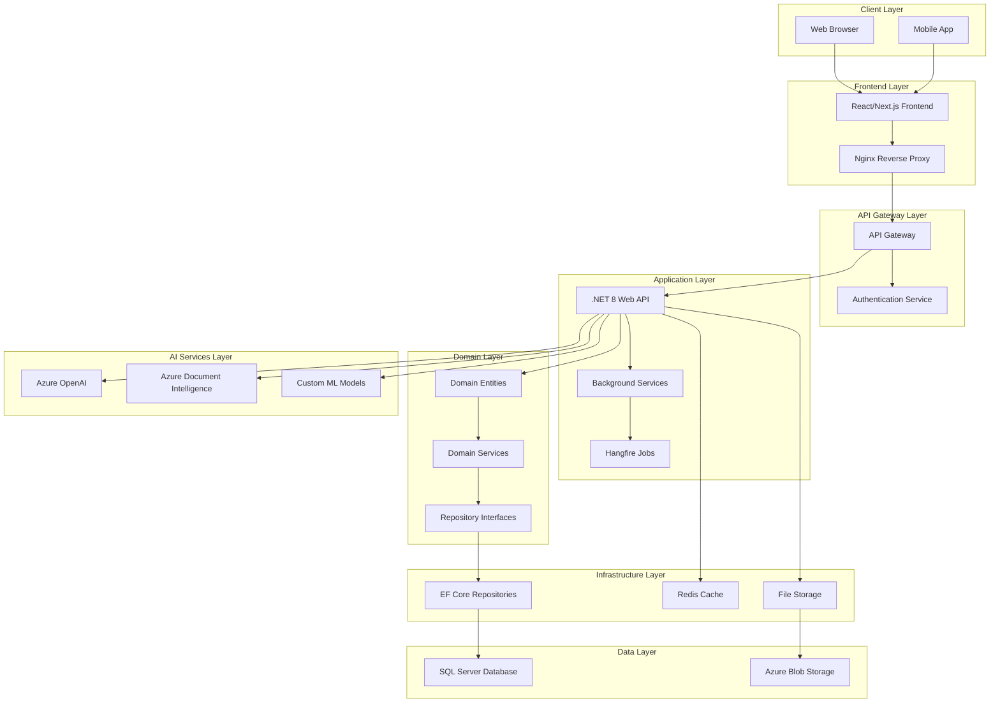

# System Architecture and Design Decisions

## Overview

The Contract Intelligence Platform (CIP) is designed as a modern, scalable, and secure web application that leverages AI to automate contract analysis while maintaining human oversight and control. The architecture follows clean architecture principles with clear separation of concerns.

## High-Level Architecture



## Technology Stack

### Frontend
- **Framework**: Next.js 14 with React 18
- **Styling**: Tailwind CSS with shadcn/ui components
- **State Management**: Zustand for global state
- **Forms**: React Hook Form with Zod validation
- **Data Fetching**: Tanstack Query (React Query)
- **Internationalization**: next-i18next for English/Arabic support
- **Charts**: Recharts for analytics and reporting

### Backend
- **Framework**: .NET 8 with ASP.NET Core
- **Architecture**: Clean Architecture with CQRS
- **ORM**: Entity Framework Core 8
- **Authentication**: JWT with ASP.NET Core Identity
- **Validation**: FluentValidation
- **Background Jobs**: Hangfire
- **Logging**: Serilog with structured logging
- **Testing**: xUnit, NSubstitute, FluentAssertions

### AI Services
- **Platform**: Python 3.9+ with FastAPI
- **ML Libraries**:
  - Transformers (Hugging Face)
  - spaCy for NLP
  - PyPDF2 for PDF processing
  - OpenAI Python SDK
- **Document Processing**: Azure Document Intelligence
- **Language Models**: Azure OpenAI (GPT-4, GPT-3.5-turbo)

### Database
- **Primary**: SQL Server 2019+
- **Caching**: Redis for session and application cache
- **File Storage**: Azure Blob Storage or local file system
- **Search**: SQL Server Full-Text Search with future Elasticsearch option

### Infrastructure
- **Containerization**: Docker with Docker Compose
- **Orchestration**: Kubernetes (production)
- **CI/CD**: Azure DevOps or GitHub Actions
- **Monitoring**: Application Insights, Prometheus + Grafana
- **Load Balancing**: Nginx or Azure Load Balancer

## Domain Model

### Core Entities

```csharp
// User Management
User (Id, Name, Email, Role, PasswordHash, IsActive)
UserProjectPermission (UserId, ProjectId, AccessLevel)

// Project and Contract Management
Project (Id, Name, Status, ClientName, Country)
Contract (Id, ProjectId, Title, Value, StartDate, EndDate, Status)
ContractFile (Id, ContractId, FileName, FilePath, FolderType)

// AI Extraction Results
MetadataField (Id, ContractId, Key, Value, Source, Confidence)
Obligation (Id, ContractId, Description, Frequency, DueDate, PenaltyText)

// Assignment and Execution
Assignment (Id, ObligationId, AssigneeUserId, Status, PercentComplete)
Evidence (Id, AssignmentId, FileName, FilePath, Description)

// Notifications and Monitoring
Notification (Id, UserId, Type, Title, Message, IsRead)
PenaltyRisk (Id, ObligationId, RiskLevel, Amount, CalculatedAt)
AuditLog (Id, UserId, Action, EntityType, EntityId, Details)
```

### Domain Services

```csharp
// Core Business Logic
public interface IContractService
{
    Task<Contract> CreateContractAsync(CreateContractDto dto);
    Task<MetadataExtractionResult> ExtractMetadataAsync(int contractId);
    Task<ObligationExtractionResult> ExtractObligationsAsync(int contractId);
}

public interface IAssignmentService
{
    Task<Assignment> CreateAssignmentAsync(CreateAssignmentDto dto);
    Task<Assignment> UpdateProgressAsync(int assignmentId, int percentComplete);
    Task<List<Assignment>> GetOverdueAssignmentsAsync();
}

public interface IPenaltyRiskService
{
    Task<PenaltyRisk> CalculateRiskAsync(int obligationId);
    Task<List<PenaltyRisk>> GetHighRiskObligationsAsync();
}
```

## Security Architecture

### Authentication and Authorization

```csharp
// JWT Token Structure
{
  "sub": "user-id",
  "email": "user@example.com",
  "role": "Manager",
  "projects": ["project-1", "project-2"],
  "exp": 1640995200
}

// Authorization Attributes
[RequireRole(UserRole.Admin)]
[RequirePermission("project-id", AccessLevel.Manager)]
public async Task<IActionResult> GetProjectData(int projectId)
```

### Access Control Matrix

| Role | Projects | Contracts | Obligations | Assignments | Users | System |
|------|----------|-----------|-------------|-------------|-------|--------|
| Admin | All | All | All | All | All | All |
| Manager | Assigned | Project-scoped | Project-scoped | Can create/assign | View only | View only |
| Subcontractor | None | None | Assigned only | Own only | Own profile | None |

### Data Protection

```csharp
// Encryption at Rest
[Personal]
public string Email { get; set; }

// Audit Logging
public async Task<T> ExecuteWithAuditAsync<T>(string action, Func<Task<T>> operation)
{
    var auditLog = new AuditLog
    {
        UserId = _currentUser.Id,
        Action = action,
        Timestamp = DateTime.UtcNow
    };

    try
    {
        var result = await operation();
        auditLog.Success = true;
        return result;
    }
    catch (Exception ex)
    {
        auditLog.Success = false;
        auditLog.ErrorMessage = ex.Message;
        throw;
    }
    finally
    {
        await _auditRepository.AddAsync(auditLog);
    }
}
```

## AI Integration Architecture

### Document Processing Pipeline

```python
# AI Service Flow
1. Document Upload → Azure Blob Storage
2. OCR Processing → Azure Document Intelligence
3. Text Extraction → Clean and structure content
4. Metadata Extraction → Azure OpenAI + Custom prompts
5. Obligation Extraction → NLP models + Pattern matching
6. Confidence Scoring → ML-based scoring
7. Human Review → Manager approval workflow
8. Data Storage → SQL Server with provenance
```

### AI Service Interface

```python
@app.post("/extract/metadata")
async def extract_metadata(request: MetadataExtractionRequest):
    """Extract metadata from contract using AI"""

    # 1. Load document from storage
    document = await load_document(request.file_path)

    # 2. OCR if needed
    if document.needs_ocr:
        text = await azure_document_intelligence.extract_text(document)
    else:
        text = document.content

    # 3. Extract metadata using OpenAI
    metadata = await openai_client.extract_metadata(text, METADATA_PROMPT)

    # 4. Validate and score confidence
    validated_metadata = validate_metadata(metadata)

    return MetadataExtractionResponse(
        metadata=validated_metadata,
        confidence_score=calculate_confidence(validated_metadata),
        processing_time=time.time() - start_time
    )
```

### Confidence Scoring Algorithm

```python
def calculate_confidence(extraction_result):
    """Calculate confidence score based on multiple factors"""

    factors = {
        'extraction_certainty': 0.4,  # Model's internal confidence
        'field_completeness': 0.3,   # How many expected fields found
        'data_consistency': 0.2,     # Internal consistency checks
        'pattern_matching': 0.1      # Regex/rule-based validation
    }

    score = 0
    for factor, weight in factors.items():
        score += get_factor_score(extraction_result, factor) * weight

    return min(max(score, 0.0), 1.0)  # Normalize to 0-1
```

## Database Design

### Schema Overview

```sql
-- Core Tables
Users (Id, Name, Email, Role, PasswordHash, IsActive, CreatedAt, UpdatedAt)
Projects (Id, Name, Status, ClientName, Country, CreatedAt, UpdatedAt)
UserProjectPermissions (Id, UserId, ProjectId, AccessLevel, GrantedAt)

-- Contract Management
Contracts (Id, ProjectId, Title, Value, StartDate, EndDate, Status, CreatedAt, UpdatedAt)
ContractFiles (Id, ContractId, FileName, FilePath, FileSize, ContentType, FolderType, UploadedAt)

-- AI Extraction Results
MetadataFields (Id, ContractId, Key, Value, Source, Confidence, OffsetsJson, CreatedAt)
Obligations (Id, ContractId, Description, Frequency, DueDate, PenaltyText, Source, Confidence, CreatedAt)

-- Assignment Workflow
Assignments (Id, ObligationId, AssigneeUserId, Status, PercentComplete, CreatedAt, UpdatedAt)
Evidence (Id, AssignmentId, FileName, FilePath, FileSize, ContentType, Description, UploadedAt)

-- Monitoring and Notifications
Notifications (Id, UserId, Type, Title, Message, RelatedEntityType, RelatedEntityId, IsRead, Status, CreatedAt)
PenaltyRisks (Id, ObligationId, RiskLevel, Amount, Description, CalculatedAt)
AuditLogs (Id, UserId, Action, EntityType, EntityId, Details, Timestamp, Success)
```

### Indexing Strategy

```sql
-- Performance Indexes
CREATE INDEX IX_Contracts_ProjectId ON Contracts(ProjectId);
CREATE INDEX IX_Obligations_ContractId ON Obligations(ContractId);
CREATE INDEX IX_Assignments_AssigneeUserId ON Assignments(AssigneeUserId);
CREATE INDEX IX_Assignments_Status ON Assignments(Status);
CREATE INDEX IX_UserProjectPermissions_UserId_ProjectId ON UserProjectPermissions(UserId, ProjectId);

-- Full-Text Search
CREATE FULLTEXT INDEX ON MetadataFields(Value);
CREATE FULLTEXT INDEX ON Obligations(Description);

-- Audit and Monitoring
CREATE INDEX IX_AuditLogs_UserId_Timestamp ON AuditLogs(UserId, Timestamp);
CREATE INDEX IX_Notifications_UserId_IsRead ON Notifications(UserId, IsRead);
```

## Performance Considerations

### Caching Strategy

```csharp
// Redis Cache Implementation
public class CacheService : ICacheService
{
    private readonly IDistributedCache _cache;

    public async Task<T> GetOrSetAsync<T>(string key, Func<Task<T>> factory, TimeSpan expiry)
    {
        var cached = await _cache.GetStringAsync(key);
        if (cached != null)
            return JsonSerializer.Deserialize<T>(cached);

        var value = await factory();
        var serialized = JsonSerializer.Serialize(value);
        await _cache.SetStringAsync(key, serialized, new DistributedCacheEntryOptions
        {
            AbsoluteExpirationRelativeToNow = expiry
        });

        return value;
    }
}

// Cache Keys Strategy
- User permissions: "user:permissions:{userId}"
- Project data: "project:data:{projectId}"
- Dashboard metrics: "dashboard:metrics:{userId}:{date}"
- AI extraction results: "ai:extraction:{contractId}"
```

### Query Optimization

```csharp
// Efficient queries with proper includes
public async Task<List<Assignment>> GetUserAssignmentsAsync(int userId)
{
    return await _context.Assignments
        .Include(a => a.Obligation)
            .ThenInclude(o => o.Contract)
                .ThenInclude(c => c.Project)
        .Include(a => a.Evidence)
        .Where(a => a.AssigneeUserId == userId)
        .OrderBy(a => a.Obligation.DueDate)
        .ToListAsync();
}

// Pagination for large datasets
public async Task<PagedResult<T>> GetPagedAsync<T>(IQueryable<T> query, int page, int pageSize)
{
    var total = await query.CountAsync();
    var items = await query
        .Skip((page - 1) * pageSize)
        .Take(pageSize)
        .ToListAsync();

    return new PagedResult<T>
    {
        Items = items,
        TotalCount = total,
        Page = page,
        PageSize = pageSize
    };
}
```

## Scalability Architecture

### Microservices Decomposition (Future)

```
┌─────────────────┐    ┌─────────────────┐    ┌─────────────────┐
│   User Service  │    │ Contract Service│    │  AI Service     │
│   - Auth        │    │ - Documents     │    │ - Extraction    │
│   - Permissions │    │ - Metadata      │    │ - Analysis      │
│   - Profiles    │    │ - Obligations   │    │ - Q&A           │
└─────────────────┘    └─────────────────┘    └─────────────────┘
         │                       │                       │
         └───────────────────────┼───────────────────────┘
                                 │
                    ┌─────────────────┐
                    │ Notification    │
                    │ Service         │
                    │ - Alerts        │
                    │ - Reminders     │
                    │ - Reports       │
                    └─────────────────┘
```

### Horizontal Scaling

```yaml
# Kubernetes Deployment
apiVersion: apps/v1
kind: Deployment
metadata:
  name: cip-api
spec:
  replicas: 3
  selector:
    matchLabels:
      app: cip-api
  template:
    metadata:
      labels:
        app: cip-api
    spec:
      containers:
      - name: api
        image: cip-api:latest
        resources:
          requests:
            memory: "256Mi"
            cpu: "250m"
          limits:
            memory: "512Mi"
            cpu: "500m"
        env:
        - name: ConnectionStrings__DefaultConnection
          valueFrom:
            secretKeyRef:
              name: db-secrets
              key: connection-string
```

## Monitoring and Observability

### Application Metrics

```csharp
// Custom Metrics
public class MetricsService : IMetricsService
{
    private readonly ILogger<MetricsService> _logger;
    private readonly Counter _apiRequests;
    private readonly Histogram _requestDuration;
    private readonly Gauge _activeUsers;

    public MetricsService(ILogger<MetricsService> logger)
    {
        _logger = logger;
        _apiRequests = Metrics.CreateCounter("cip_api_requests_total", "Total API requests");
        _requestDuration = Metrics.CreateHistogram("cip_api_request_duration_seconds", "API request duration");
        _activeUsers = Metrics.CreateGauge("cip_active_users", "Currently active users");
    }

    public void RecordApiRequest(string endpoint, string method, int statusCode)
    {
        _apiRequests.WithTags("endpoint", endpoint, "method", method, "status", statusCode.ToString()).Inc();
    }
}
```

### Health Checks

```csharp
// Health Check Configuration
services.AddHealthChecks()
    .AddSqlServer(connectionString, tags: new[] { "database" })
    .AddRedis(redisConnectionString, tags: new[] { "cache" })
    .AddHttpClient("ai-service", client => client.BaseAddress = aiServiceUrl, tags: new[] { "ai" })
    .AddCheck<FileStorageHealthCheck>("file-storage", tags: new[] { "storage" });
```

## Error Handling and Resilience

### Global Exception Handling

```csharp
public class ExceptionHandlingMiddleware
{
    private readonly RequestDelegate _next;
    private readonly ILogger<ExceptionHandlingMiddleware> _logger;

    public async Task InvokeAsync(HttpContext context)
    {
        try
        {
            await _next(context);
        }
        catch (Exception ex)
        {
            _logger.LogError(ex, "An unhandled exception occurred");
            await HandleExceptionAsync(context, ex);
        }
    }

    private static async Task HandleExceptionAsync(HttpContext context, Exception exception)
    {
        var response = exception switch
        {
            NotFoundException => new { message = exception.Message, statusCode = 404 },
            ValidationException => new { message = exception.Message, statusCode = 400 },
            UnauthorizedException => new { message = "Unauthorized", statusCode = 401 },
            _ => new { message = "An error occurred while processing your request", statusCode = 500 }
        };

        context.Response.StatusCode = response.statusCode;
        context.Response.ContentType = "application/json";
        await context.Response.WriteAsync(JsonSerializer.Serialize(response));
    }
}
```

### Retry Policies

```csharp
// Polly Retry Policies
services.AddHttpClient<IAiService, AiService>()
    .AddPolicyHandler(GetRetryPolicy())
    .AddPolicyHandler(GetCircuitBreakerPolicy());

static IAsyncPolicy<HttpResponseMessage> GetRetryPolicy()
{
    return HttpPolicyExtensions
        .HandleTransientHttpError()
        .WaitAndRetryAsync(
            retryCount: 3,
            sleepDurationProvider: retryAttempt =>
                TimeSpan.FromSeconds(Math.Pow(2, retryAttempt)),
            onRetry: (outcome, timespan, retryCount, context) =>
            {
                Console.WriteLine($"Retry {retryCount} after {timespan} seconds");
            });
}
```

## Design Decisions and Rationale

### 1. Clean Architecture Choice
- **Decision**: Use Clean Architecture with CQRS pattern
- **Rationale**: Ensures separation of concerns, testability, and maintainability
- **Trade-offs**: Additional complexity for simple operations, but better long-term scalability

### 2. Entity Framework Core vs Dapper
- **Decision**: Entity Framework Core for primary ORM
- **Rationale**: Better development velocity, change tracking, migrations
- **Trade-offs**: Some performance overhead, but acceptable for POC requirements

### 3. JWT vs Session-based Authentication
- **Decision**: JWT tokens with refresh token rotation
- **Rationale**: Stateless, scalable, works well with SPA and mobile apps
- **Trade-offs**: Token management complexity, but better for distributed systems

### 4. Azure OpenAI vs Self-hosted Models
- **Decision**: Azure OpenAI for production, local fallbacks for development
- **Rationale**: Better reliability, compliance, and model quality
- **Trade-offs**: Cost and vendor lock-in, but acceptable for enterprise use

### 5. SQL Server vs PostgreSQL
- **Decision**: SQL Server for primary database
- **Rationale**: Enterprise compliance, existing infrastructure, full-text search
- **Trade-offs**: Licensing costs, but better integration with .NET ecosystem

### 6. React vs Angular
- **Decision**: React with Next.js
- **Rationale**: Better performance, SSR support, larger ecosystem
- **Trade-offs**: More configuration needed, but better flexibility

## Future Enhancements

### Phase 2 Considerations
- Microservices decomposition
- Event-driven architecture with message queues
- Advanced AI models (fine-tuned on contract data)
- Real-time collaboration features
- Mobile native applications
- Advanced analytics and BI integration

### Technical Debt Items
- Implement proper CQRS with separate read/write models
- Add comprehensive integration tests
- Implement circuit breaker patterns for all external services
- Add performance benchmarking and monitoring
- Implement proper event sourcing for audit trails

---

This architecture provides a solid foundation for the Contract Intelligence Platform while maintaining flexibility for future enhancements and scaling requirements.